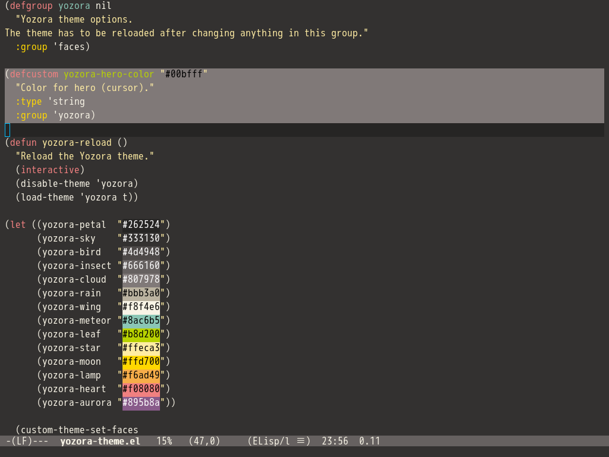

# Yozora テーマ

Yozoraは、夜空を見ているかのような安らぎとリラックスした雰囲気を作り出すために設計された、GNU Emacs用のダークカラーテーマです。



## インストール方法

Yozoraテーマをインストールするには、以下の手順に従ってください。

1. `yozora-theme.el`ファイルをダウンロードし、Emacsのテーマディレクトリに保存します。Emacsのテーマディレクトリは通常、`~/.emacs.d/themes/`です。

2. Emacsの設定ファイル `~/.emacs.d/init.el`に以下のコードを追加します。

```elisp
(add-to-list 'custom-theme-load-path "~/.emacs.d/themes")
```

このコードは、Emacsがテーマを検索する場所のリストにEmacsテーマディレクトリのパスを追加します。

3. 以下のコマンドを使用して、Yozoraテーマを読み込みます。

`M-x` `load-theme` `RET` `yozora` `RET`

このコマンドは、Yozoraテーマを読み込みます。テーマを読み込んだ後、Emacsはエディタの背景、テキスト、およびその他の要素にYozoraの色のスキームを使用します。

（オプション）Emacsが起動するたびにYozoraがデフォルトのテーマになるように設定する場合は、以下のコードをEmacsの設定ファイルに追加します。

```elisp
(load-theme 'yozora t)
```

## カスタマイズ方法

Yozoraテーマをカスタマイズすることができます。Yozoraには、カーソルの色を変更できるカスタマイズオプションが用意されています。

### ヒーロー（カーソル）の色を変更する

ヒーローはEmacsのカーソルです。以下の手順で、ヒーローの色を変更できます。

1. 以下のコマンドを入力します。

`M-x` `customize-option` `RET` `yozora-hero-color` `RET`

このコマンドは、`yozora-hero-color`オプションのカスタマイズバッファーを開きます。

2. ヒーローの色を変更します。カラーピッカーウィジットを使用して色を調整してください。

3. `Apply and Save` をクリックして変更を確定します。

4. 以下のコマンドを入力して、テーマを再読み込みします。

`M-x` `yozora-reload` `RET`

このコマンドは、更新されたヒーローの色を使用して、Yozoraテーマを再読み込みします。

Yozoraテーマは、目に優しいスタイリッシュなテーマが欲しいEmacsユーザーにとって最適なオプションです。お楽しみください！
